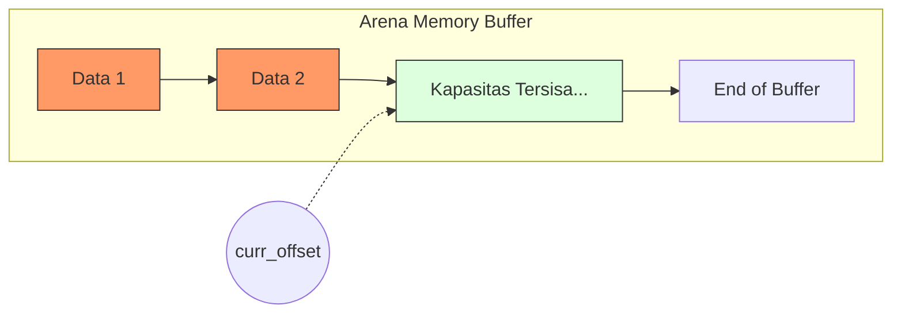

# Dokumentasi Proyek: Arena Allocator (Minggu 1)

## 1. Pendahuluan
**Arena Allocator** (atau sering disebut *Bump Allocator*) adalah salah satu mekanisme manajemen memori yang paling sederhana dan efisien. Alih-alih mengalokasikan dan membebaskan memori secara individual (seperti `malloc` dan `free`), Arena Allocator mengambil satu blok memori besar di awal dan membaginya sesuai permintaan dengan cara menggeser sebuah "pointer" atau "offset".

Dalam proyek ini, Arena Allocator digunakan untuk mengelola memori statis (`static_buffer`) tanpa bergantung pada heap management standar sistem operasi.

---

## 2. Struktur Data
Struktur utama didefinisikan dalam `arena.h`:

```c
typedef struct {
    uint8_t *buffer;    // Alamat awal blok memori
    size_t capacity;    // Kapasitas maksimum arena (dalam bytes)
    size_t curr_offset; // Lokasi "garis batas" alokasi saat ini
} Arena;
```

- **`buffer`**: Pointer ke array memori tempat data akan disimpan.
- **`capacity`**: Batas maksimum memori yang bisa digunakan.
- **`curr_offset`**: Menunjukkan seberapa banyak memori yang sudah terpakai. Setiap kali ada alokasi baru, nilai ini akan bertambah ("bumped").

---

## 3. Analisis Fungsi

### `arena_init`
Menginisialisasi struktur Arena.
- **Tujuan**: Menghubungkan struct `Arena` dengan buffer memori yang sudah disiapkan dan mengatur offset awal ke 0.
- **Kompleksitas**: $O(1)$.

### `arena_alloc`
Memesan ruang di dalam arena.
- **Logika**: 
  1. Periksa apakah sisa kapasitas masih mencukupi (`curr_offset + size <= capacity`).
  2. Jika cukup, simpan `curr_offset` saat ini sebagai alamat awal data baru.
  3. Tambah `curr_offset` sebesar `size` yang diminta.
  4. Kembalikan offset awal tadi.
- **Return**: Offset memori atau `(size_t)-1` jika penuh (Overflow).
- **Kompleksitas**: $O(1)$.

### `arena_get`
Mengubah offset menjadi pointer alamat memori yang sebenarnya.
- **Tujuan**: Karena `arena_alloc` mengembalikan offset, kita butuh fungsi ini untuk mendapatkan pointer asli agar bisa menulis/membaca data.
- **Rumus**: `buffer + offset`.
- **Kompleksitas**: $O(1)$.

### `arena_reset`
Mengosongkan seluruh arena sekaligus.
- **Logika**: Cukup dengan mengatur `curr_offset` kembali ke 0.
- **Catatan**: Data lama sebenarnya masih ada di memori, namun "dianggap" kosong karena alokasi berikutnya akan menimpa data tersebut.
- **Kompleksitas**: $O(1)$ (Sangat cepat dibandingkan `free` berulang kali).

---

## 4. Visualisasi Konsep



Saat alokasi dilakukan:
1. `Data 1` masuk -> `curr_offset` bergeser.
2. `Data 2` masuk -> `curr_offset` bergeser lagi.
3. Reset -> `curr_offset` kembali ke posisi paling kiri.

---

## 5. Alur Eksekusi (`main.c`)
1. **Inisialisasi**: Arena disiapkan dengan kapasitas 1024 bytes (1KB).
2. **Alokasi**: Memesan 2 slot untuk integer.
3. **Penulisan**: Nilai `1999` dan `2026` disimpan ke alamat yang didapat dari `arena_get`.
4. **Pembacaan**: Mengambil kembali nilai dari memori.
5. **Reset**: Mengosongkan arena sehingga siap digunakan dari awal lagi.

---

## 6. Kelebihan dan Kekurangan

| Kelebihan | Kekurangan |
| :--- | :--- |
| **Sangat Cepat**: Alokasi dan de-alokasi hanya $O(1)$. | **Fragmentation**: Tidak bisa menghapus satu elemen saja di tengah. |
| **Bebas Memory Leak**: Cukup reset satu kali untuk membersihkan semuanya. | **Fixed Size**: Ukuran buffer harus ditentukan di awal. |
| **Deterministik**: Waktu eksekusi sangat stabil. | |

---
## 7. Kesimpulan
Arena Allocator dalam proyek ini adalah solusi efisien untuk manajemen memori pada sistem yang membutuhkan kecepatan tinggi atau lingkungan *embedded* di mana penggunaan `malloc` dinamis mungkin berisiko menyebabkan fragmentasi heap.
